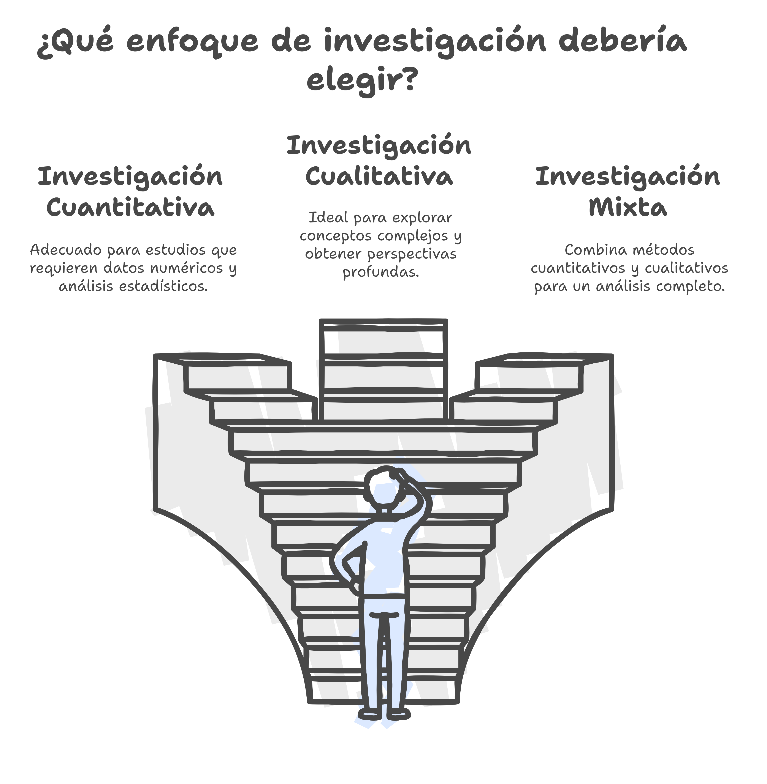

# ¿Qué es un Trabajo Fin de Máster (TFM)?

{term}`positivista`

## Introducción

El **Trabajo Fin de Máster (TFM)** es una pieza clave en la formación de posgrado. Su realización permite al estudiante demostrar su capacidad para llevar a cabo una investigación rigurosa, aplicar conocimientos adquiridos y desarrollar un pensamiento crítico dentro de su especialidad académica. Esta guía proporciona orientaciones esenciales para la elaboración de un TFM en el marco del Máster en Educación Digital.

## ¿Qué es un TFM?

:::{glossary}
Trabajo Fin de Máster
: Un **Trabajo Fin de Máster (TFM)** es un proyecto individual, memoria o estudio de investigación original, que reúne y desarrolla los conocimientos, competencias, habilidades y capacidades adquiridas durante los estudios de máster. Su objetivo es demostrar la capacidad del estudiante para realizar una investigación rigurosa, reflexiva y autónoma en el ámbito académico de la especialidad elegida. Debe basarse en una investigación empírica o en fuentes documentales. El trabajo puede ser puramente teórico, aunque se recomienda que sea empírico, utilizando datos o informaciones obtenidas de la realidad, ya sea en forma de fuentes documentales (textos, imágenes, páginas web) o a través de la recolección de datos mediante cuestionarios, entrevistas, observación participante, etc.
:::

Un **TFM** es un estudio original que integra y desarrolla competencias adquiridas durante el máster. Puede adoptar diversas formas, como:

::::{grid} 1 1 2 3

:::{card}
:header: Investigación empírica o en fuentes documentales
- {term}`Investigación Cuantitativa`
- {term}`Investigación Cualitativa`
- {term}`Investigación Mixta`
:::

:::{card}
:header: Revisión de la literatura científica
- Sistemática
- Meta-análisis
:::

:::{card}
:header: Desarrollo y evaluación de propuestas educativas
- Metodológicas
- Tecnológicas
:::
::::

El TFM debe tener un enfoque académico, con un problema de investigación claro, un marco teórico bien fundamentado y una metodología adecuada para el análisis de datos.

:::{error} ¿Qué no es un TFM?
:name: notfm

- Un trabajo sin una definición clara del problema y objetivos de investigación.
- Una recopilación de información sin un análisis crítico.
- Un documento sin base teórica o metodológica.
- Un texto sin rigor académico o sin relación con el ámbito del máster.
:::

## Características de un TFM de calidad

Un TFM debe ser:

:::{tip} TFM de calidad
:name: tfmcalidad

- **Original y relevante**, con una contribución significativa al ámbito de estudio.
- **Metodológicamente sólido**, con una justificación clara de los enfoques utilizados.
- **Estructurado y coherente**, siguiendo un esquema lógico y una redacción académica.
- **Basado en fuentes fiables**, con referencias actualizadas y correctamente citadas.
:::

## Estructura Típica del TFM

:::{glossary}
Estructura TFM
: Apartados fundamentales 
1. **Portada**
2. **Resumen**: abstract en español e inglés)
3. **Agradecimientos**: opcional
4. **Índice**: numerado
5. **Introducción**: planteamiento del problema y objetivos)
6. **Marco teórico**: revisión de la literatura relevante)
7. **Metodología** (descripción detallada del enfoque, técnicas y herramientas utilizadas)
8. **Resultados** (análisis e interpretación de los hallazgos)
9. **Discusión y conclusiones** (evaluación de resultados y futuras líneas de investigación)
10. **Referencias bibliográficas**
11. **Anexos** (si aplica)
:::

## Metodologías de Investigación Educativa

### Tradiciones y Corrientes de Investigación

El enfoque metodológico dependerá del tipo de investigación. Existen diversas metodologías, en base a diferentes **tradiciones de investigación** ({term}`Positivista`, {term}`Postpositivista`, {term}`Constructivista`, {term}`Transformador` y {term}`Pragmático`). 

De este planteamiento se derivan **3 grandes corrientes de investigación**: ()

:::{glossary}
Investigación Cuantitativa
: Adecuada  para estudios que requieren datos numéricos y análisis estadísticos.

Investigación Cualitativa
: Ideal para explorar conceptos complejos y obtener perspectivas profundas.

Investigación Mixta
: Combina métodos cuantitativos y cualitativos para un análisis completo.
:::

:::{figure}
:label: fig:meto2

Elección del enfoque de investigación
:::

A su vez, estas corrientes se pueden subdividir en diferentes **diseños de investigación**:

::::{tab-set}

:::{tab-item} Investigación Cuantitativa
* No expermiental
* Pre-experimental
* Cuasi-experimental
* Experimental
:::

:::{tab-item} Investigación Cualitativa
* Estudio de Caso
* Investigación Narrativa
* Investigación Etnográfica
* Fenomenológica
* Grounded-Theory
* Investigación-Acción
* Investigación Basada en Diseño
:::

:::{tab-item} Investigación Mixta
* Investigación Cuantitativa + Investigación Cualitativa
::::

### Metodologías recomendadas por el Máster

::::{tab-set}

:::{tab-item} Investigación Cuantitativa
- **Investigación de análisis del funcionamiento de diferentes ámbitos de los sistemas educativos y las tecnologías digitales (TD)**: Estudios sobre el impacto de las tecnologías digitales en la educación, o investigaciones comparativas sobre modelos educativos apoyados en las TD.
:::

:::{tab-item} Investigación Cualitativa
- **Revisión Sistemática de la Literatura (RSL)**: Revisión bibliográfica sobre temáticas específicas de investigación en Tecnología Educativa o sobre determinadas fuentes especializadas en esta área.
:::

:::{tab-item} Investigación Mixta
- **Investigación aplicada**: Estudio de caso sobre la integración de las tecnologías digitales en la actividad educativa formal, no formal o informal.
::::

## Consejos prácticos para la elaboración del TFM

:::{tip} Consejos prácticos para la elaboración del TFM
:name: tfmconsejos

1. **Planificación:** Diseña un cronograma con tiempos estimados para cada fase.
2. **Elección del tema:** Opta por un tema que te motive y tenga relevancia académica.
3. **Revisión bibliográfica:** Utiliza fuentes fiables y actualizadas.
4. **Metodología adecuada:** Justifica la selección de métodos y herramientas.
5. **Redacción académica:** Evita subjetividades y utiliza un lenguaje formal y preciso.
6. **Revisión y corrección:** Solicita retroalimentación y revisa el texto antes de la entrega.
:::

## Recursos recomendados
∫
- **Gestores bibliográficos:** Zotero, Mendeley, EndNote, RefWorks.
- **Software de análisis de datos:** SPSS, R, NVivo, ATLAS.ti.
- **Herramientas de escritura académica:** Markdown

