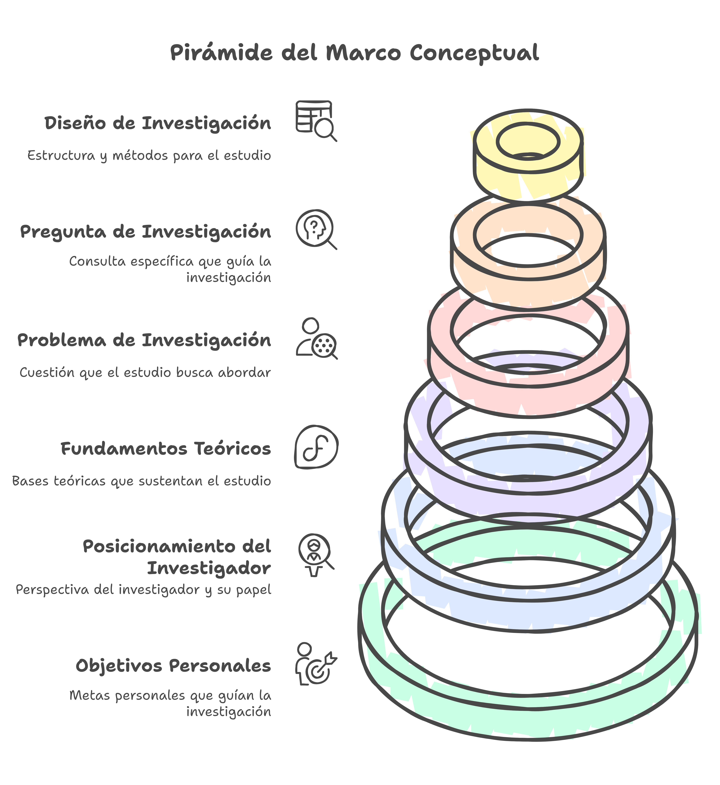

# ¿Qué es un Marco Conceptual?

## ¿Cuál es núcleo fundamental de la investigación?

:::{glossary}
Marco Conceptual
: El marco conceptual es una estructura argumentativa y organizada de conceptos que permite justificar la importancia de un tema de investigación y la idoneidad de los medios propuestos para su análisis. Funciona como un andamiaje teórico que delimita las razones del estudio, establece su relevancia y verifica la rigurosidad de los métodos utilizados {cite:p}`2021jorrin5`. Es, por tanto, un elemento fundamental en cualquier investigación, ya que no solo orienta el desarrollo del estudio, sino que también proporciona una base sólida sobre la cual se construyen los argumentos y se interpretan los hallazgos.

Según {cite}`2017ravitch`, el marco conceptual es un conjunto de argumentos que explican por qué el tema que se pretende analizar es significativo y por qué los medios propuestos para su estudio son adecuados y rigurosos. En este sentido, se trata de un producto construido por el investigador a partir de piezas prestadas, como teorías previas y experiencias existentes, con el fin de situar la investigación en un campo determinado y señalar vacíos aún no explorados. No es un simple resumen de conceptos, sino una estructura reflexiva que permite articular diferentes perspectivas teóricas en función de los objetivos del estudio.

Además, el marco conceptual cumple un papel clave en la interconexión entre la dimensión teórica y la metodología, asegurando la coherencia y solidez del proceso investigativo. Es decir, permite que las decisiones metodológicas estén fundamentadas en un cuerpo teórico pertinente, evitando que el estudio carezca de sustento o que los datos recopilados sean interpretados de manera arbitraria. En última instancia, el marco conceptual no solo guía la investigación, sino que también ayuda a identificar lagunas en el conocimiento existente, ofreciendo así una justificación para la pertinencia del estudio y abriendo nuevas líneas de exploración dentro del campo académico.
:::

## ¿Cuáles son las 6 puntales del Marco Conceptual?

Durante estas tres semanas te vas a dedicar a desarrollar el **Marco Conceptual** de la investigación (), nucleo fundamental de cualquier estudio y **reto** de esta asignatura. A lo largo de este curso es necesario que realices una serie de lecturas () que te servirán para realizar las tareas (). Las tareas intermedias hay que entregalas en los forso del curso del campus virtual y las 2 tareas finales hay que subirlas como documentos ([info](#lugar)). Existe un [calendario de entrega sugerido](#aprox).

- [ ]  (05/01/2025)
    - {term}`Objetivos Personales` 

- [ ]  (07/01/2025)
    - {term}`Posición del Investigador` 

- [ ]  (12/01/2025)
    - {term}`Fundamentos Teóricos`  

- [ ]  (14/01/2025)
    - {term}`Problema de Investigación` 

- [ ]  (18/01/2025)
    - {term}`Preguntas de Investigación`

- [ ]  (20/01/2025)
    - {term}`Diseño de Investigación` 

:::{figure}
:label: fig:marco

Los 6 puntales del Marco Conceptual de una Investigación
:::

